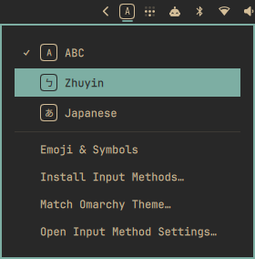

# Input Menu



A macOS-style input source menu for the Omarchy bar, for anyone typing with fcitx5.

- The boxed badge shows the current input method **and mode**: `A`, `ㄅ`, `あ`, `ア`.
- Click it for every input method and engine mode, with a check on the current one. Arrow keys, Enter and Esc work; right-click toggles like `Ctrl+Space`.
- It updates on window focus changes and fcitx5 events. Nothing polls: when idle it starts no processes.
- Names follow the system language: English, 繁體中文, 日本語. Zhuyin, Japanese (Mozc) and ABC get macOS-style names; any other engine shows the name fcitx5 gives it.
- When fcitx5 isn't running, the badge dims and the menu offers **Start Input Method**. With only one input method, the notice offers **Install Input Methods…** instead; otherwise that action is in the footer.

## Requires

- Omarchy 4 with Quickshell and fcitx5 started by the `omarchy-fcitx5` user service.
- `jq`, `busctl`/systemd and `hyprctl` for live input state and the enable/disable commands.
- Omarchy's floating presentation terminal, `gum`, `pacman` and `omarchy-pkg-add` for the guided install flow.
- Optional `fcitx5-configtool` for **Open Input Method Settings…**; installing engines does not require it.
- `node`, Qt 6 `qmllint`, `grim` and `wtype` only for `./verify.sh` (not for using the menu). Bash and the usual Linux tools, including `flock` and `sha256sum`, are supplied by Omarchy.

## Install

```sh
omarchy plugin add https://github.com/Ray0907/omarchy-input-menu.git --enable
```

Omarchy starts fcitx5 without its tray interface, which is where the current mode comes from. On first use the menu offers **Enable Input Menu…**; it turns the interface on, restarts fcitx5 once, and hides fcitx5's own tray icon, since Input Menu shows the same thing. No sudo needed.

**Save your work first.** Already-open applications may need to be refocused or reopened before typing works again after the restart.

## Install input methods

Choose **Install Input Methods…** and select your languages: Zhuyin (Traditional Chinese), Pinyin/Shuangpin/Cangjie/Wubi (Chinese), Japanese (Mozc), Korean or Vietnamese. Chinese Addons offers a second choice of input methods, with Pinyin recommended.

Only missing packages are installed. Omarchy asks for your password in the floating terminal; Input Menu does not request privileges itself. If installation fails, fcitx5 and its group are left alone.

When new engines need loading, it warns about open windows and asks before restarting fcitx5. Save your work: applications may need to be refocused or reopened afterward. Declining keeps the packages installed but leaves the group unchanged; run the action again to finish. Already-loaded engines need no restart.

New input methods are appended to the group without removing, reordering or changing existing entries. Switch with the badge menu or `Ctrl+Space`. When fcitx5 is stopped, use **Start Input Method** first.

## Candidate window theme

The candidate window and switch popup match the current Omarchy colors, including readable page arrows on light themes. Theme changes reload the colors without restarting fcitx5; an already-open candidate keeps its old paint until its next update.

Input Menu takes over automatically only when fcitx5's `Theme` and `DarkTheme` are unset or stock (`default` / `default-dark`). Any other choice is **claimed** and left alone. **Match Omarchy Theme…** in the menu explicitly takes over; disabling restores the previous values only where they still name our theme.

```sh
scripts/theme status --json  # enabled, free, or claimed
scripts/theme enable         # explicit takeover; --auto respects claimed choices
scripts/theme disable        # restore previous values and remove our files
```

The tray enable/disable commands also apply/release the theme, without failing the tray step if theme cleanup must be deferred. Theme commands never start fcitx5 themselves.

## What it changes

- **Tray interface, after Enable Input Menu…:** writes `~/.config/systemd/user/omarchy-fcitx5.service.d/zz-input-menu.conf` to enable fcitx5's tray add-on, then restarts the user service. Other drop-ins are left alone. `scripts/disable` removes this override and restarts again.
- **Duplicate tray icon, after Enable:** hides `Fcitx` in `~/.config/omarchy/shell.json` and records whether it added that hiding in `~/.local/state/input-menu-enable.json`. `scripts/disable` unhides only what Input Menu hid and removes its record.
- **Candidate theme, after Enable when stock, or Match Omarchy Theme…:** records the previous values in `~/.local/state/input-menu/theme.json`; installs `input-menu-fcitx5*.tpl` under `~/.config/omarchy/themed/`, the `theme-set.d/input-menu` hook and `~/.local/share/fcitx5/themes/omarchy-input-menu/`. `scripts/theme disable` (also called by `scripts/disable`) restores values still naming our theme and removes those files. Omarchy's harmless rendered copies under `~/.local/state/omarchy/current/theme/input-menu-fcitx5*` may remain; after disabling, those named copies can be deleted too.
- **Packages and group, only after your install choices:** installs the selected missing packages through Omarchy and appends the loaded methods through fcitx5's D-Bus API. To undo, remove unwanted methods in fcitx5's settings and uninstall unwanted packages with your package manager. Plugin removal deliberately leaves both alone.
- **Mode names, as engines are used:** caches their modes in `~/.local/state/input-menu-modes.json`. It can be deleted after removing the plugin; nothing else uses it.

## Remove

```sh
~/.config/omarchy/plugins/io.github.ray0907.input-menu/scripts/disable
omarchy plugin remove io.github.ray0907.input-menu
```

`disable` removes the override and restarts fcitx5 again, so the same advice applies. It unhides the tray icon only if Input Menu was the one that hid it.

## Limits

- An engine's modes appear in the menu after it has been used once on this machine; they are then cached.
- fcitx5-chewing doesn't publish full/half-width state.
- Zhuyin's switch popup keeps the label `酷`: on fcitx5 5.1.22, a label-only user override replaces the input-method entry and disables Chewing, so Input Menu leaves it alone.
- Mozc Romaji and the ABC keyboard share the badge `A`; their names in the menu differ.
- The candidate window's position can't be configured in fcitx5's classic UI.

## End-to-end test

`./verify.sh` runs on an Omarchy machine against the real fcitx5. It needs an unlocked session, **no application windows**, and a single fcitx5 owned by the user service; it refuses otherwise, because restarting fcitx5 invalidates open windows' input contexts.

Its candidate-theme baseline must be **free**; it refuses a claimed or enabled baseline before changing settings. It checks ownership, idempotence, independently read palette colors and hashed glyphs on gruvbox, tokyo-night and flexoki-light. Candidate screenshots are opened after each switch so their paint is current.

It checks guided install using already-installed Chewing and Mozc, with a failing package-install guard: no packages are installed. It checks appended order/layouts, no restart, a no-op repeat and Zhuyin typing.

It types into a throwaway terminal, restarts fcitx5, and temporarily changes the input group, shell locale, theme and bar layout. It restores all of that on exit, including on errors and signals, and leaves a log and screenshots in `verify-out/` (the screenshots are for looking at, not automated checks).

The result is `ALL PASS`, `PASS WITH SKIPS: <steps>` or `SOME FAILED`. A skipped step is never counted as a pass: if the compositor doesn't deliver a synthetic mouse click the run says `PASS WITH SKIPS: mouse-click`, and on more than one monitor the idle check is skipped.

### If a run is interrupted

The script records what it is about to change in `~/.local/state/input-menu-verify/` before changing anything. This includes fcitx5 `Theme`/`DarkTheme`, the Omarchy theme name, and the presence, permissions and bytes of our templates, hook, theme folder, state/lock and rendered files. Restore destinations are fixed in code, never loaded from the manifest. A new run refuses to start while an interrupted one is unresolved.

- `./verify.sh --status` shows whether a run is in progress, interrupted or clean.
- `./verify.sh --recover` only **previews**: it lists saved and current values and marks unchanged ones as skipped.
- `./verify.sh --recover --yes` applies them. Look at every difference first; anything you changed by hand since the interruption is overwritten.
- If fcitx5 has to restart while other applications are open, recovery refuses unless you also pass `--yes-restart-fcitx5`.

If `--status` says the recovery data is **broken**, stop and restore by hand:

1. Look at `restore.json` and `backups/` in `~/.local/state/input-menu-verify/`; check ownership and compare `sha256sum` with a copy you trust.
2. Restore `backups/shell.json` to `~/.config/omarchy/shell.json`.
3. Restore `backups/zz-input-menu.conf` to `~/.config/systemd/user/omarchy-fcitx5.service.d/`, or delete that file if the original was absent.
4. Run `systemctl --user daemon-reload` and `omarchy-restart-shell`.
5. Inspect saved `classicui` and restore its two values through guarded `busctl --user --auto-start=no ... SetConfig` only when fcitx5 is running. Do not delete a theme folder while either active value still names it.
6. Restore trusted `candidate-templates` files to `~/.config/omarchy/themed/`, `candidate-rendered` files to `~/.local/state/omarchy/current/theme/`, `candidate-hook` to `~/.config/omarchy/hooks/theme-set.d/input-menu`, `candidate-folder` to `~/.local/share/fcitx5/themes/omarchy-input-menu`, and `candidate-state` / `candidate-lock` to `~/.local/state/input-menu/theme.json` / `lock`. An absent saved item means it was absent originally. Leave unrelated files alone.
7. Check the input group, current input method, locale, theme, candidate files and tray, then delete the `in-progress` marker in that directory.

`VERIFY_FAIL_AFTER=<step> ./verify.sh` makes a run fail at a chosen checkpoint, to exercise the restore path. `VERIFY_KILL_AFTER=<step>` instead sends SIGKILL so the durable `--recover` path can be checked. `guided-install` stops just after temporarily removing Chewing and Mozc from the group; `theme-tokyo-night` is a mid-theme checkpoint. Both have no test window open. Preview recovery changes no settings, and applying it restores the saved baseline, including the exact input group and fcitx5 launch configuration.
